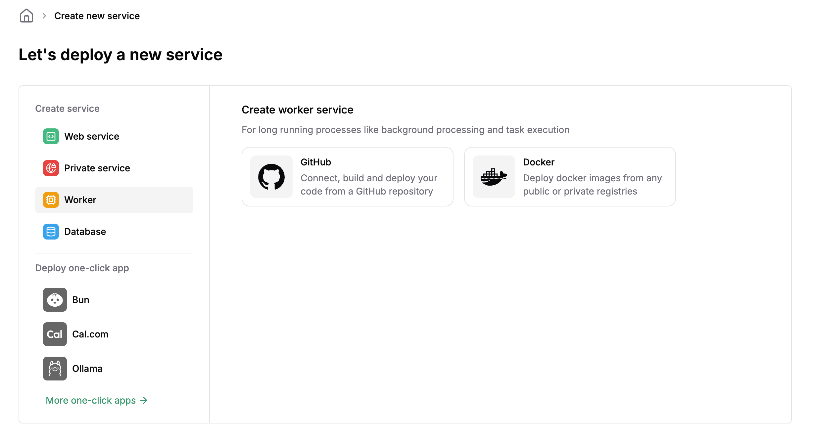
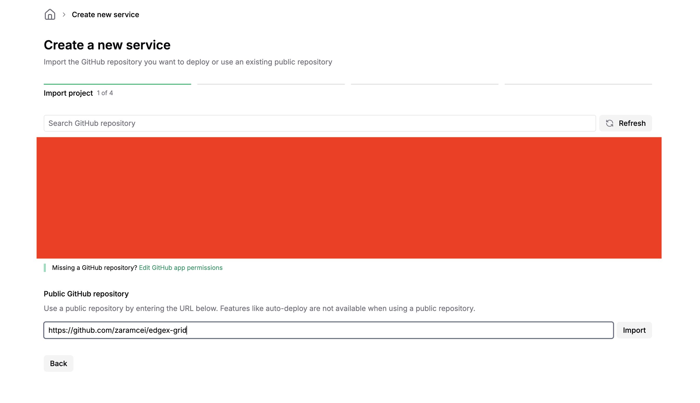
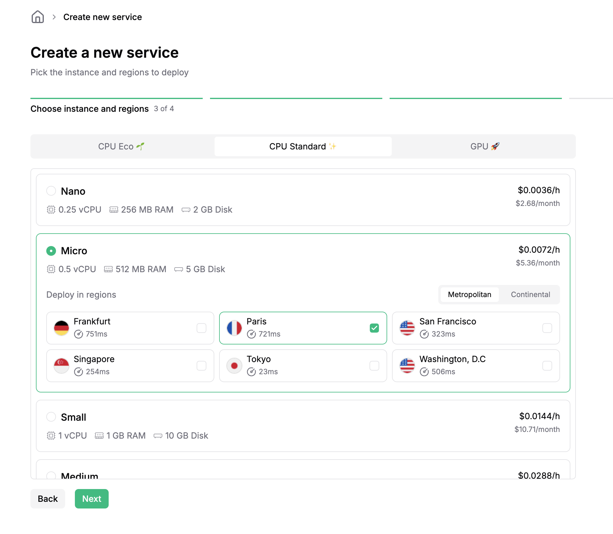
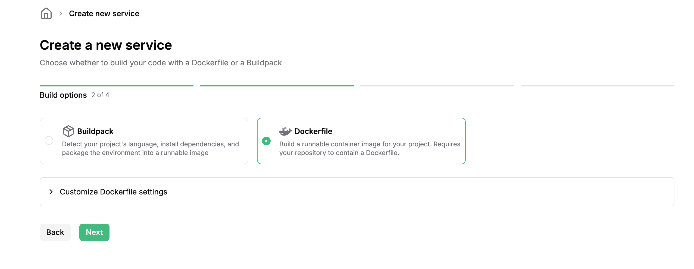
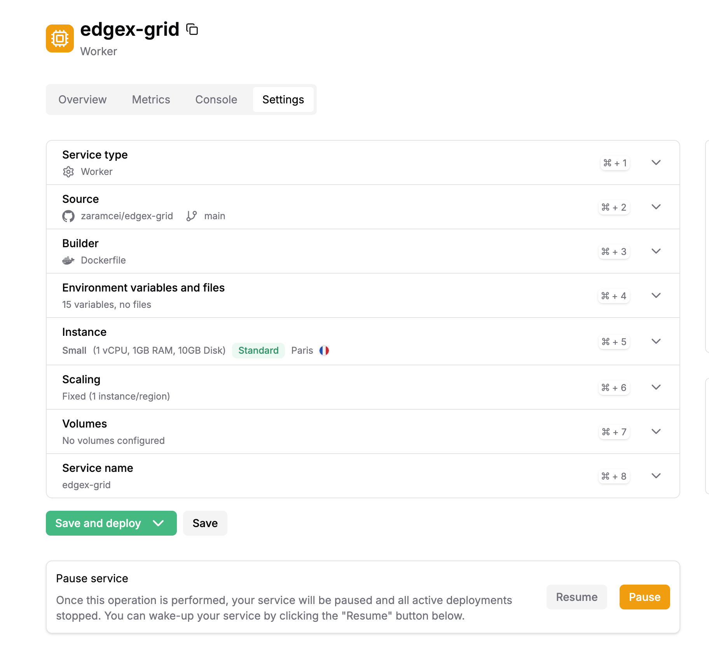

# EdgeX Grid Bot 修正版 (Koyeb)

## 1. 設置方法

## 1.1 [Koyeb](https://app.koyeb.com/services/new)を開く

[Koyeb - service new](https://app.koyeb.com/services/new)を開く

必ず`Worker`かつ`Github`を選択すること

Public Github Repositoryに以下のURLを入れる

`https://github.com/zaramcei/edgex-grid`

必ず以前稼働していたリージョンと同じ場所、同じCPUを選択する

Dockerfileを選択

## 1.2 環境変数を以下の解説に従って設定する

`Environment variable and files`を開く

以下の画像はあくまで設定例なのでこの画像の通りに設定せず、指示されたパラメータで稼働させてください。

設定したら`Save and deploy`を押して起動する

# 2. 設定値の解説

## 2.1 基本設定（必須）

- `EDGEX_ACCOUNT_ID`: あなたのEdgeXアカウントID（数値）
- `EDGEX_STARK_PRIVATE_KEY`: あなたの秘密鍵
- `EDGEX_BASE_URL`: EdgeX APIのベースURL（デフォルト: `https://pro.edgex.exchange`）
- `EDGEX_CONTRACT_ID`: 取引する銘柄のID（例: BTC-PERPは `10000001`）
- `EDGEX_LEVERAGE`: 取引レバレッジ倍率（例: `100`）- 損益率の計算に使用

## 2.2 グリッド設定

- `EDGEX_GRID_STEP_USD`: グリッド幅（USD）- 価格レベル間の間隔（例: `10`, `50`, `100`）
- `EDGEX_GRID_FIRST_OFFSET_USD`: 中央価格からの初回オフセット（USD）（例: `10`, `50`）
- `EDGEX_GRID_LEVELS_PER_SIDE`: 片側（買い/売り）のグリッド本数（例: `5`, `10`）
- `EDGEX_GRID_SIZE`: 1本あたりの注文数量（BTC）（例: `0.001`, `0.002`）
- `EDGEX_GRID_OP_SPACING_SEC`: 注文間の待機時間（秒）- レート制限回避用（デフォルト: `0.1`）

## 2.3 ポジションベースのロスカット/利確設定（設定が難しくロスカットが頻発するので非推奨）

基本的には2.4のアセットベースのロスカットの方を設定してください。

保有中のポジションの未実現損益（レバレッジを考慮）が指定の閾値に達したら、そのポジションを成行注文で自動的にクローズする機能です。

**挙動:**
- ポジション単位で個別に損益を監視
- 損益率 = (未実現損益 / ポジション価値) × レバレッジ倍率
- 閾値に達した瞬間に成行でポジションクローズ
- クローズ後、すぐに通常のグリッド取引を再開

**設定:**
- `EDGEX_POSITION_LOSSCUT_PERCENTAGE`: ポジションの未実現損益が指定%以下になったら自動ロスカット（例: `10` = -10%でロスカット）
  - `null`または未設定の場合はロスカットを実行しない
- `EDGEX_POSITION_TAKE_PROFIT_PERCENTAGE`: ポジションの未実現損益が指定%以上になったら自動利確（例: `10` = +10%で利確）
  - `null`または未設定の場合は利確を実行しない

## 2.4 資産ベースのロスカット/利確設定

口座全体の総資産（残高+未実現損益）を監視し、ポジション開始時の資産を基準にして指定%の変動があった場合に全ポジションをクローズする機能です。ポジション単位ではなく口座全体の資産を保護します。

**挙動:**
- 総資産 = 現在の残高 + 全ポジションの未実現損益
- 基準資産（initial_asset）はポジションを持っていない時の残高
- ポジション保有中に総資産が基準資産から指定%変動したら発動
- 発動時の処理:
  1. 全ポジションを成行で即座にクローズ
  2. 全ての未約定注文をキャンセル
  3. クローズ完了を確認後、基準資産を現在の残高に更新
  4. 30秒のクールダウン後、通常のグリッド取引を再開
- 次回ポジションは新しい基準資産から損益を計算

**設定:**
- `EDGEX_ASSET_LOSSCUT_PERCENTAGE`: 総資産（残高+未実現損益）がポジション開始時の資産から指定の%減少したら全ポジションクローズ（デフォルト: `3.0` = -3%）
  - 例: `0.05`に設定すると、総資産が-0.05%（約-0.2 USD at 400 USD）減少時にロスカット
  - ポジション単位ではなく、口座全体の資産を保護する機能
- `EDGEX_ASSET_TAKE_PROFIT_PERCENTAGE`: 総資産が初期資産から指定%増加したら全ポジションクローズ（デフォルト: `5.0` = +5%）
  - `0`または未設定の場合は利確を実行しない

## 2.5 全戻し全決済による資産リカバリー設定

資産が減少した後のポジションで含み益が出ているケースのうち、未実現損益と現在の（減少した）資産価格の合計値が初期資産額に到達したらポジションを全部クローズする機能に関する設定

- `EDGEX_BALANCE_RECOVERY_ENABLED`: バランスリカバリー機能の有効/無効（`true` or `false`）
  - 残高が初期残高まで回復したら全ポジションをクローズする機能
- `EDGEX_INITIAL_BALANCE_USD`: 初期残高（USD）- リカバリーの基準値（例: `400.0`）
- `EDGEX_RECOVERY_ENFORCE_LEVEL_USD`: リカバリーモードを有効にする最小損失額（USD）（デフォルト: `3.0`）
  - 初期残高から指定額以上の損失が出た場合のみリカバリーモードが発動